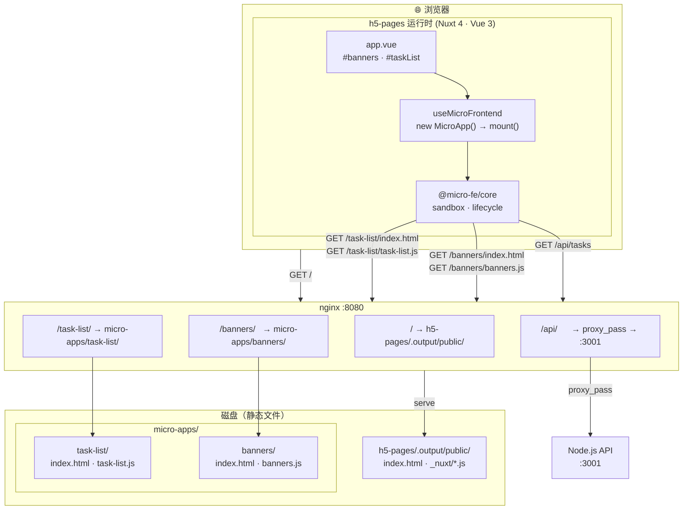
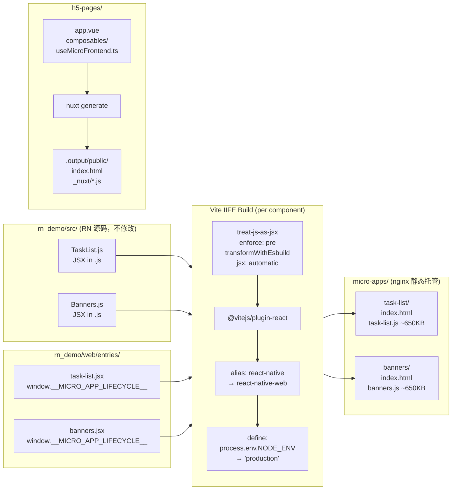
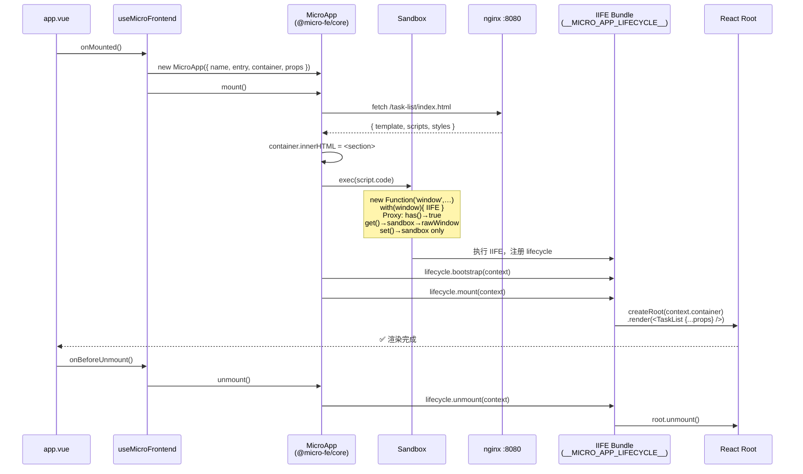
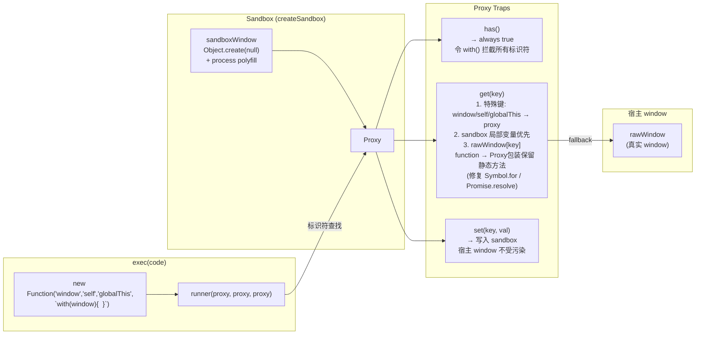
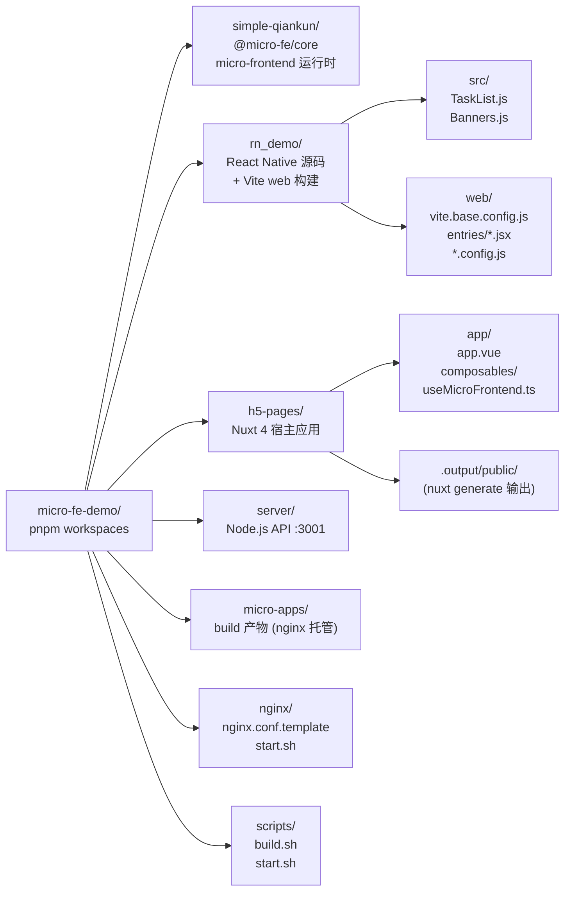
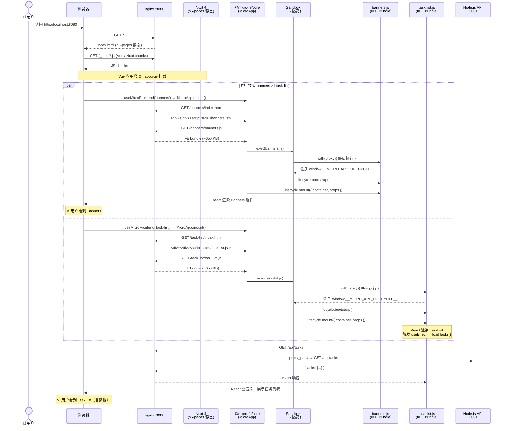
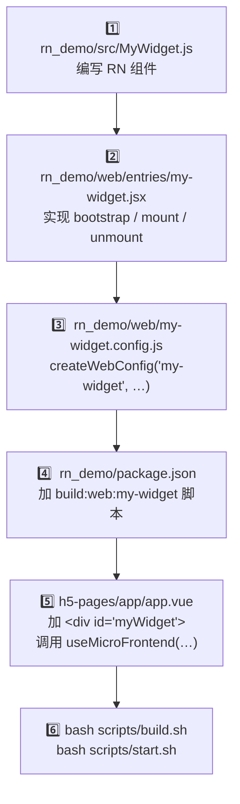

# Micro Frontend Architecture

## 系统拓扑

```mermaid
graph TD
    subgraph Browser["🌐 浏览器"]
        subgraph host["h5-pages 运行时  (Nuxt 4 · Vue 3)"]
            AppVue["app.vue\n#banners · #taskList"]
            Composable["useMicroFrontend\nnew MicroApp() → mount()"]
            Core["@micro-fe/core\nsandbox · lifecycle"]
            AppVue --> Composable --> Core
        end
    end

    subgraph nginx["nginx :8080"]
        R_root["/ → h5-pages/.output/public/"]
        R_tl["/task-list/ → micro-apps/task-list/"]
        R_bn["/banners/   → micro-apps/banners/"]
        R_api["/api/      → proxy_pass → :3001"]
    end

    subgraph disk["磁盘（静态文件）"]
        H5Out["h5-pages/.output/public/\nindex.html · _nuxt/*.js"]
        subgraph micro["micro-apps/"]
            TL["task-list/\nindex.html · task-list.js"]
            BN["banners/\nindex.html · banners.js"]
        end
    end

    API["Node.js API\n:3001"]

    Browser -->|"GET /"| nginx
    nginx -->|"serve"| H5Out
    Core -->|"GET /task-list/index.html\nGET /task-list/task-list.js"| nginx
    Core -->|"GET /banners/index.html\nGET /banners/banners.js"| nginx
    R_tl --> TL
    R_bn --> BN
    Core -->|"GET /api/tasks"| nginx
    R_api -->|"proxy_pass"| API
```

## 构建管道

```mermaid
flowchart LR
    subgraph src["rn_demo/src/  (RN 源码，不修改)"]
        TLjs["TaskList.js\nJSX in .js"]
        BNjs["Banners.js\nJSX in .js"]
    end

    subgraph entries["rn_demo/web/entries/"]
        TLjsx["task-list.jsx\nwindow.__MICRO_APP_LIFECYCLE__"]
        BNjsx["banners.jsx\nwindow.__MICRO_APP_LIFECYCLE__"]
    end

    subgraph vite["Vite IIFE Build  (per component)"]
        P1["treat-js-as-jsx\nenforce: pre\ntransformWithEsbuild\njsx: automatic"]
        P2["@vitejs/plugin-react"]
        P3["alias: react-native\n→ react-native-web"]
        P4["define:\nprocess.env.NODE_ENV\n→ 'production'"]
        P1 --> P2 --> P3 --> P4
    end

    subgraph out["micro-apps/  (nginx 静态托管)"]
        OTL["task-list/\nindex.html\ntask-list.js  ~650KB"]
        OBN["banners/\nindex.html\nbanners.js    ~650KB"]
    end

    subgraph nuxt["h5-pages/"]
        NuxtSrc["app.vue\ncomposables/\nuseMicroFrontend.ts"]
        NuxtGen["nuxt generate"]
        NuxtOut[".output/public/\nindex.html\n_nuxt/*.js"]
        NuxtSrc --> NuxtGen --> NuxtOut
    end

    TLjs & TLjsx --> vite --> OTL
    BNjs & BNjsx --> vite --> OBN
```

## 运行时加载协议

```mermaid
sequenceDiagram
    participant Vue as app.vue
    participant C as useMicroFrontend
    participant MA as MicroApp<br/>(@micro-fe/core)
    participant SB as Sandbox
    participant NG as nginx :8080
    participant LC as IIFE Bundle<br/>(__MICRO_APP_LIFECYCLE__)
    participant RC as React Root

    Vue->>C: onMounted()
    C->>MA: new MicroApp({ name, entry, container, props })
    C->>MA: mount()
    MA->>NG: fetch /task-list/index.html
    NG-->>MA: { template, scripts, styles }
    MA->>MA: container.innerHTML = <section>
    MA->>SB: exec(script.code)
    Note over SB: new Function('window',…)<br/>with(window){ IIFE }<br/>Proxy: has()→true<br/>get()→sandbox→rawWindow<br/>set()→sandbox only
    SB->>LC: 执行 IIFE，注册 lifecycle
    MA->>LC: lifecycle.bootstrap(context)
    MA->>LC: lifecycle.mount(context)
    LC->>RC: createRoot(context.container)<br/>.render(<TaskList {...props} />)
    RC-->>Vue: ✅ 渲染完成

    Vue->>C: onBeforeUnmount()
    C->>MA: unmount()
    MA->>LC: lifecycle.unmount(context)
    LC->>RC: root.unmount()
```

## Sandbox 隔离机制

```mermaid
flowchart LR
    subgraph host["宿主 window"]
        HW["rawWindow\n(真实 window)"]
    end

    subgraph sb["Sandbox (createSandbox)"]
        SW["sandboxWindow\nObject.create(null)\n+ process polyfill"]
        PX["Proxy"]
        SW --> PX
    end

    subgraph traps["Proxy Traps"]
        Has["has()\n→ always true\n令 with() 拦截所有标识符"]
        Get["get(key)\n1. 特殊键: window/self/globalThis → proxy\n2. sandbox 局部变量优先\n3. rawWindow[key]\n   function → Proxy包装保留静态方法\n   (修复 Symbol.for / Promise.resolve)"]
        Set["set(key, val)\n→ 写入 sandbox\n宿主 window 不受污染"]
    end

    subgraph exec["exec(code)"]
        FN["new Function('window','self','globalThis',\n  `with(window){ <IIFE> }`)"]
        RUN["runner(proxy, proxy, proxy)"]
        FN --> RUN
    end

    PX --> Has & Get & Set
    RUN -->|标识符查找| PX
    Get -->|fallback| HW
```

## Workspace 目录结构

```mermaid
graph LR
    Root["micro-fe-demo/\npnpm workspaces"]

    Root --> Core["simple-qiankun/\n@micro-fe/core\nmicro-frontend 运行时"]
    Root --> RN["rn_demo/\nReact Native 源码\n+ Vite web 构建"]
    Root --> H5["h5-pages/\nNuxt 4 宿主应用"]
    Root --> SV["server/\nNode.js API :3001"]
    Root --> MA["micro-apps/\nbuild 产物 (nginx 托管)"]
    Root --> NX["nginx/\nnginx.conf.template\nstart.sh"]
    Root --> SC["scripts/\nbuild.sh\nstart.sh"]

    RN --> RNSrc["src/\nTaskList.js\nBanners.js"]
    RN --> RNWeb["web/\nvite.base.config.js\nentries/*.jsx\n*.config.js"]

    H5 --> H5App["app/\napp.vue\ncomposables/\nuseMicroFrontend.ts"]
    H5 --> H5Out[".output/public/\n(nuxt generate 输出)"]
```

## 用户看到页面的完整时序

```mermaid
sequenceDiagram
    actor User as 👤 用户
    participant Browser as 浏览器
    participant Nginx as nginx :8080
    participant Nuxt as Nuxt 4<br/>(h5-pages 静态)
    participant Core as @micro-fe/core<br/>(MicroApp)
    participant Sandbox as Sandbox<br/>(JS 隔离)
    participant BannerBundle as banners.js<br/>(IIFE Bundle)
    participant TaskBundle as task-list.js<br/>(IIFE Bundle)
    participant API as Node.js API<br/>:3001

    User->>Browser: 访问 http://localhost:8080

    %% ── 阶段一：加载宿主页面 ──────────────────────────
    Browser->>Nginx: GET /
    Nginx-->>Browser: index.html (h5-pages 静态)
    Browser->>Nginx: GET /_nuxt/*.js (Vue / Nuxt chunks)
    Nginx-->>Browser: JS chunks
    Note over Browser,Nuxt: Vue 应用启动 · app.vue 挂载

    %% ── 阶段二：并行加载两个微应用入口 ────────────────
    par 并行挂载 banners 和 task-list
        Browser->>Core: useMicroFrontend('banners') → MicroApp.mount()
        Core->>Nginx: GET /banners/index.html
        Nginx-->>Core: <div></div><script src="./banners.js">
        Core->>Nginx: GET /banners/banners.js
        Nginx-->>Core: IIFE bundle (~650 KB)
        Core->>Sandbox: exec(banners.js)
        Sandbox->>BannerBundle: with(proxy){ IIFE 执行 }
        BannerBundle-->>Sandbox: 注册 window.__MICRO_APP_LIFECYCLE__
        Core->>BannerBundle: lifecycle.bootstrap()
        Core->>BannerBundle: lifecycle.mount({ container, props })
        BannerBundle-->>Browser: React 渲染 Banners 组件
        Note over Browser: ✅ 用户看到 Banners
    and
        Browser->>Core: useMicroFrontend('task-list') → MicroApp.mount()
        Core->>Nginx: GET /task-list/index.html
        Nginx-->>Core: <div></div><script src="./task-list.js">
        Core->>Nginx: GET /task-list/task-list.js
        Nginx-->>Core: IIFE bundle (~650 KB)
        Core->>Sandbox: exec(task-list.js)
        Sandbox->>TaskBundle: with(proxy){ IIFE 执行 }
        TaskBundle-->>Sandbox: 注册 window.__MICRO_APP_LIFECYCLE__
        Core->>TaskBundle: lifecycle.bootstrap()
        Core->>TaskBundle: lifecycle.mount({ container, props })
        Note over TaskBundle: React 渲染 TaskList<br/>触发 useEffect → loadTasks()
    end

    %% ── 阶段三：task-list 拉取业务数据 ─────────────────
    TaskBundle->>Nginx: GET /api/tasks
    Nginx->>API: proxy_pass → GET /api/tasks
    API-->>Nginx: { tasks: [...] }
    Nginx-->>TaskBundle: JSON 响应
    TaskBundle-->>Browser: React 重渲染，展示任务列表
    Note over Browser: ✅ 用户看到 TaskList（含数据）
```

## 扩展新组件

```mermaid
flowchart TD
    S1["1️⃣  rn_demo/src/MyWidget.js\n编写 RN 组件"]
    S2["2️⃣  rn_demo/web/entries/my-widget.jsx\n实现 bootstrap / mount / unmount"]
    S3["3️⃣  rn_demo/web/my-widget.config.js\ncreateWebConfig('my-widget', …)"]
    S4["4️⃣  rn_demo/package.json\n加 build:web:my-widget 脚本"]
    S5["5️⃣  h5-pages/app/app.vue\n加 &lt;div id='myWidget'&gt;\n调用 useMicroFrontend(…)"]
    S6["6️⃣  bash scripts/build.sh\nbash scripts/start.sh"]

    S1 --> S2 --> S3 --> S4 --> S5 --> S6
```
